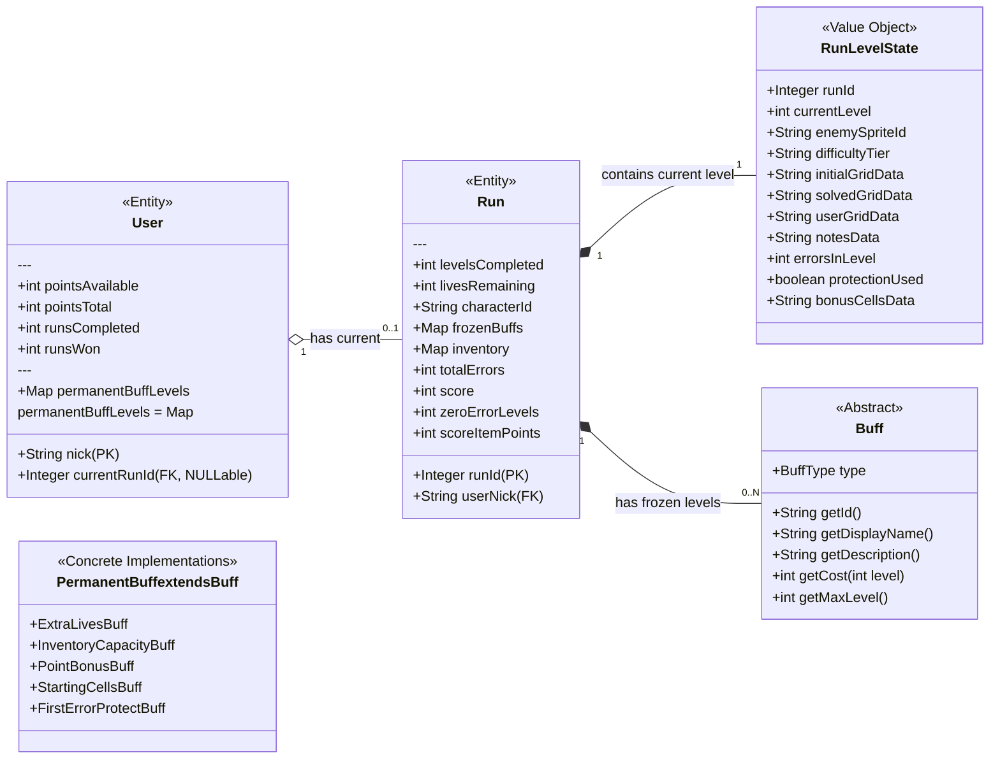

### Class Diagram

This diagram defines the persistent data structure (`User`, `Run`) and their relationships with the domain model.

```mermaid
classDiagram
    direction LR

    class User{
        <<Entity>>
        +String nick (PK)
        +Integer currentRunId (FK, NULLable)
        ---
        +int pointsAvailable
        +int pointsTotal
        +int runsCompleted
        +int runsWon
        ---
        +Map<String, int> permanentBuffLevels
    }

    class Run{
        <<Entity>>
        +Integer runId (PK)
        +String userNick (FK)
        ---
        +int levelsCompleted
        +int livesRemaining
        +String characterId
        +Map<String, int> frozenBuffs
        +Map<String, int> inventory
        +int totalErrors
        +int score
        +int zeroErrorLevels
        +int scoreItemPoints
    }

    class RunLevelState{
        <<Value Object>>
        +Integer runId
        +int currentLevel
        +String enemySpriteId
        +String difficultyTier
        +String initialGridData
        +String solvedGridData
        +String userGridData
        +String notesData
        +int errorsInLevel
        +boolean protectionUsed
        +String bonusCellsData
    }

    class Buff{
        <<Abstract>>
        +BuffType type
        +String getId()
        +String getDisplayName()
        +String getDescription()
        +int getCost(int level)
        +int getMaxLevel()
    }
    
    class PermanentBuff extends Buff{
        <<Concrete Implementations>>
        +ExtraLivesBuff
        +InventoryCapacityBuff
        +PointBonusBuff
        +StartingCellsBuff
        +FirstErrorProtectBuff
    }

    User "1" o-- "0..1" Run : has current
    Run "1" *-- "1" RunLevelState : contains current level
    Run "1" *-- "0..N" Buff : has frozen levels
    
    User : permanentBuffLevels = Map<BuffId, Level>
```
