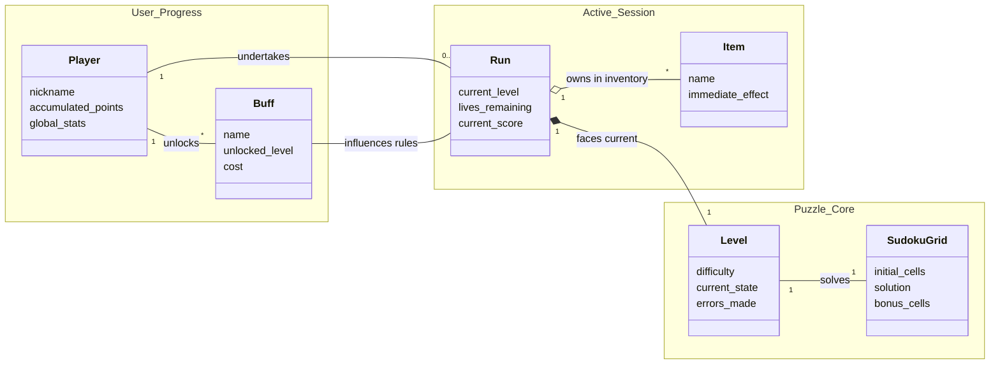

### Domain Model (Analysis)

This diagram represents the key concepts of the domain and their relationships, abstracting from implementation details.

```mermaid
classDiagram
    direction LR
    
    namespace User_Progress {
        class Player {
            nickname
            accumulated_points
            global_stats
        }
        class Buff {
            name
            unlocked_level
            cost
        }
    }

    namespace Active_Session {
        class Run {
            current_level
            lives_remaining
            current_score
        }
        class Item {
            name
            immediate_effect
        }
    }

    namespace Puzzle_Core {
        class Level {
            difficulty
            current_state
            errors_made
        }
        class SudokuGrid {
            initial_cells
            solution
            bonus_cells
        }
    }

    Player "1" -- "0..1" Run : undertakes
    Player "1" -- "*" Buff : unlocks
    
    Run "1" *-- "1" Level : faces current
    Run "1" o-- "*" Item : owns in inventory
    
    Level "1" -- "1" SudokuGrid : solves
    
    Buff -- Run : influences rules
```
