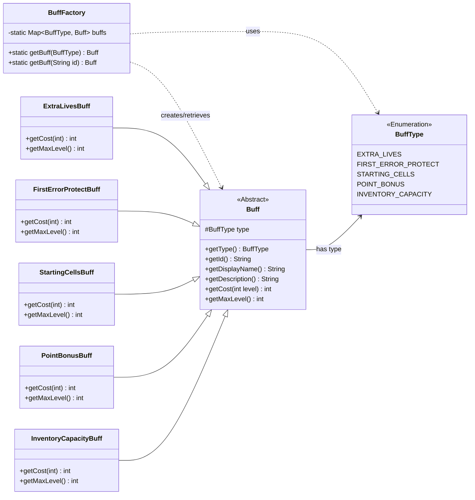

### Factory Pattern (Buffs)

The BuffFactory decouples the retrieval of specific Buff metadata from the business logic, allowing for centralized management of game bonuses. The Buff classes act as prototypes/data-holders defining the properties of each upgrade.

