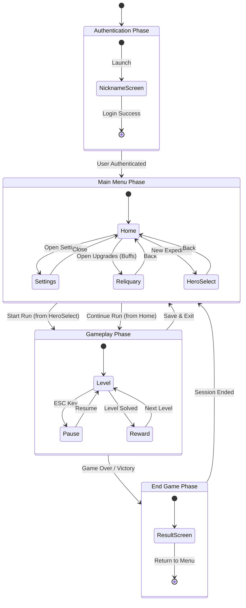

### Navigation Diagram (UI States)

Maps the navigation flow between different application screens, organized by functional areas.

```mermaid
stateDiagram
    direction TB

    state "Authentication Phase" as Auth {
        [*] --> NicknameScreen : Launch
        NicknameScreen --> [*] : Login Success
    }

    state "Main Menu Phase" as Menu {
        [*] --> Home
        
        Home --> Settings : Open Settings
        Settings --> Home : Close
        
        Home --> Reliquary : Open Upgrades (Buffs)
        Reliquary --> Home : Back
        
        Home --> HeroSelect : New Expedition
        HeroSelect --> Home : Back
    }

    state "Gameplay Phase" as Game {
        [*] --> Level
        
        Level --> Pause : ESC Key
        Pause --> Level : Resume
        
        Level --> Reward : Level Solved
        Reward --> Level : Next Level
    }

    state "End Game Phase" as End {
        [*] --> ResultScreen
        ResultScreen --> [*] : Return to Menu
    }

    [*] --> Auth
    Auth --> Menu : User Authenticated
    
    Menu --> Game : Start Run (from HeroSelect)
    Menu --> Game : Continue Run (from Home)
    
    Game --> Menu : Save & Exit
    Game --> End : Game Over / Victory
    
    End --> Menu : Session Ended
```
