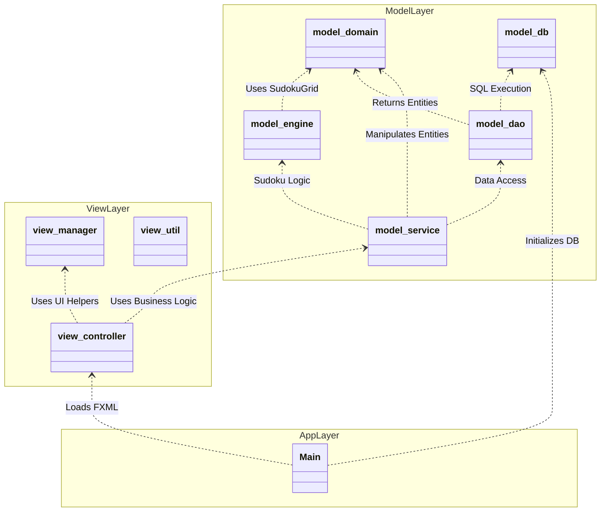

### Package Diagram (Architecture)

Illustrates the source code organization following the MVC pattern and separation of concerns.

**Package Description:**
*   **view**: JavaFX graphical interface management.
    *   `controller`: User interaction logic (e.g., `GameController`).
    *   `manager`: UI state managers (e.g., `SoundManager`, `UserInfoManager`).
*   **model**: Business logic and data.
    *   `domain`: Pure entities (e.g., `User`, `Run`, `SudokuGrid`).
    *   `service`: Application logic (e.g., `RunService`, `SudokuGenerator`).
    *   `dao`: Data Access Objects for SQL queries.
    *   `db`: SQLite connection and schema management.
    *   `engine`: Sudoku specific logic (validation, generation).
