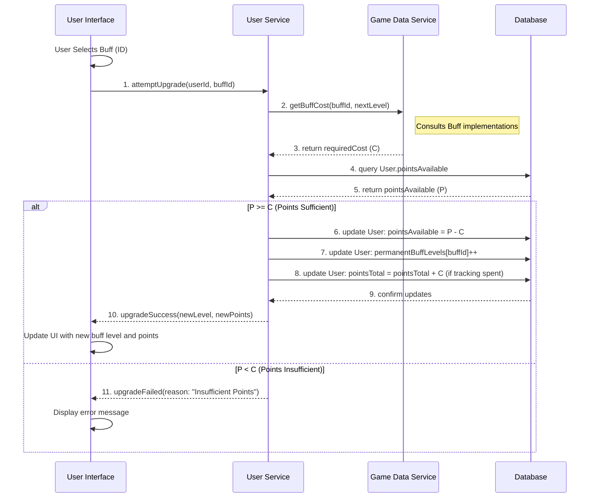

### Sequence Diagram: The Ancestor's Legacy (Buff Purchase)

Models point verification logic, permanent buff level updates, and user economy management.

```mermaid
sequenceDiagram
    participant UI as User Interface
    participant UserService as User Service
    participant GameDataService as Game Data Service
    participant DB as Database

    UI->>UI: User Selects Buff (ID)
    UI->>UserService: 1. attemptUpgrade(userId, buffId)

    UserService->>GameDataService: 2. getBuffCost(buffId, nextLevel)
    Note right of GameDataService: Consults Buff implementations
    GameDataService-->>UserService: 3. return requiredCost (C)
    
    UserService->>DB: 4. query User.pointsAvailable
    DB-->>UserService: 5. return pointsAvailable (P)

    alt P >= C (Points Sufficient)
        UserService->>DB: 6. update User: pointsAvailable = P - C
        UserService->>DB: 7. update User: permanentBuffLevels[buffId]++
        UserService->>DB: 8. update User: pointsTotal = pointsTotal + C (if tracking spent)

        DB-->>UserService: 9. confirm updates
        UserService-->>UI: 10. upgradeSuccess(newLevel, newPoints)
        UI->>UI: Update UI with new buff level and points
    
    else P < C (Points Insufficient)
        UserService-->>UI: 11. upgradeFailed(reason: "Insufficient Points")
        UI->>UI: Display error message
    end
```
