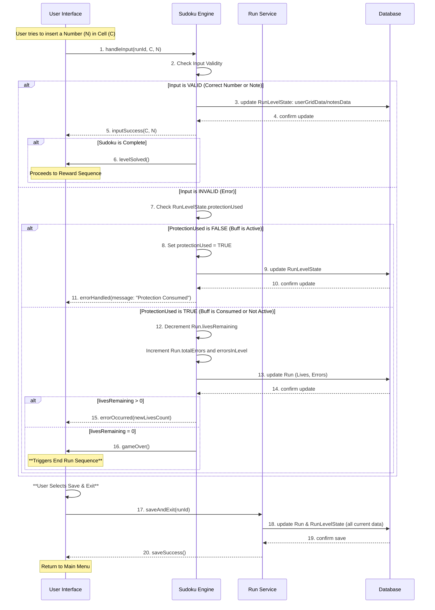

### Sequence Diagram: Level Interaction and Saving

Models user input on Sudoku, error checking, life/buff loss logic, and manual saving.

```mermaid
sequenceDiagram
    participant UI as User Interface
    participant SudokuEngine as Sudoku Engine
    participant RunService as Run Service
    participant DB as Database

    Note over UI: User tries to insert a Number (N) in Cell (C)
    UI->>SudokuEngine: 1. handleInput(runId, C, N)

    SudokuEngine->>SudokuEngine: 2. Check Input Validity
    
    alt Input is VALID (Correct Number or Note)
        SudokuEngine->>DB: 3. update RunLevelState: userGridData/notesData
        DB-->>SudokuEngine: 4. confirm update
        SudokuEngine-->>UI: 5. inputSuccess(C, N)
        
        alt Sudoku is Complete
            SudokuEngine->>UI: 6. levelSolved()
            Note over UI: Proceeds to Reward Sequence
        end
        
    else Input is INVALID (Error)
        SudokuEngine->>SudokuEngine: 7. Check RunLevelState.protectionUsed
        
        alt ProtectionUsed is FALSE (Buff is Active)
            SudokuEngine->>SudokuEngine: 8. Set protectionUsed = TRUE
            SudokuEngine->>DB: 9. update RunLevelState
            DB-->>SudokuEngine: 10. confirm update
            SudokuEngine-->>UI: 11. errorHandled(message: "Protection Consumed")
            
        else ProtectionUsed is TRUE (Buff is Consumed or Not Active)
            SudokuEngine->>SudokuEngine: 12. Decrement Run.livesRemaining
            SudokuEngine->>SudokuEngine: Increment Run.totalErrors and errorsInLevel
            
            SudokuEngine->>DB: 13. update Run (Lives, Errors)
            DB-->>SudokuEngine: 14. confirm update

            alt livesRemaining > 0
                SudokuEngine-->>UI: 15. errorOccurred(newLivesCount)
            else livesRemaining = 0
                SudokuEngine->>UI: 16. gameOver()
                Note over UI: **Triggers End Run Sequence**
            end
        end
    end

    UI->>UI: **User Selects Save & Exit**
    UI->>RunService: 17. saveAndExit(runId)
    RunService->>DB: 18. update Run & RunLevelState (all current data)
    DB-->>RunService: 19. confirm save
    RunService-->>UI: 20. saveSuccess()
    Note over UI: Return to Main Menu
```
