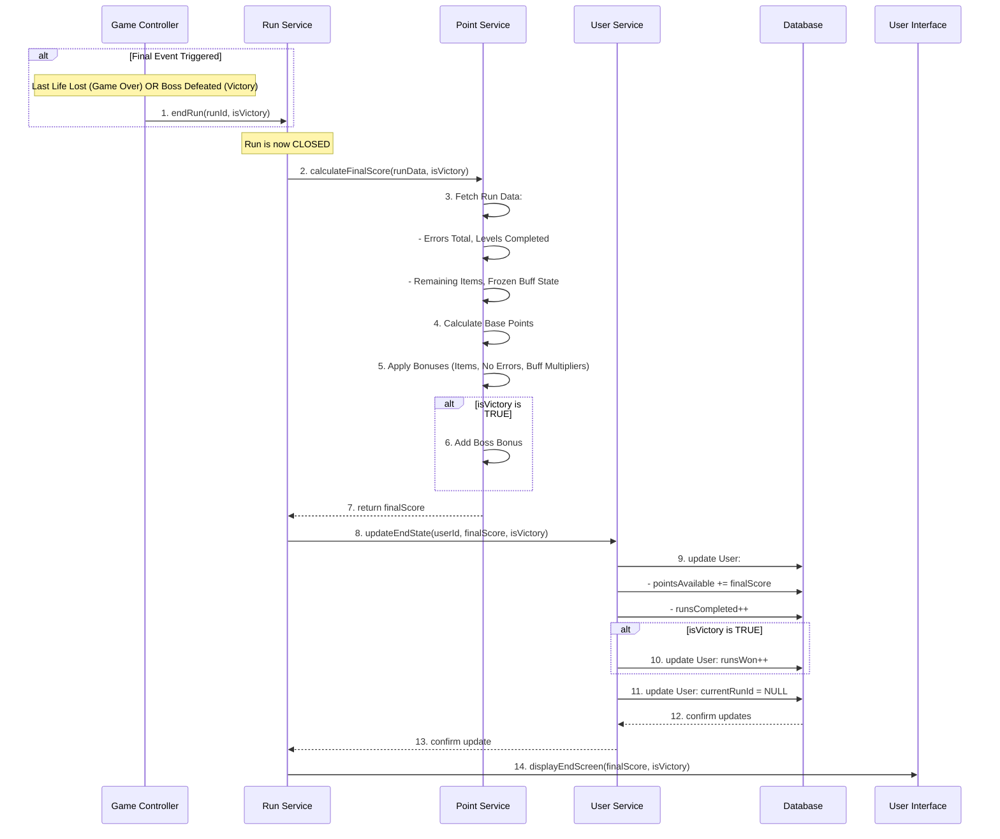

### Sequence Diagram: End Run (Game Over and Victory)

Models run conclusion: score calculation, user statistics update, and current run reference cleanup.

```mermaid
sequenceDiagram
    participant GameController as Game Controller
    participant RunService as Run Service
    participant PointService as Point Service
    participant UserService as User Service
    participant DB as Database
    participant UI as User Interface

    alt Final Event Triggered
        Note over GameController: Last Life Lost (Game Over) OR Boss Defeated (Victory)
        GameController->>RunService: 1. endRun(runId, isVictory)
    end
    
    Note over RunService: Run is now CLOSED
    
    RunService->>PointService: 2. calculateFinalScore(runData, isVictory)
    
    PointService->>PointService: 3. Fetch Run Data:
    PointService->>PointService: - Errors Total, Levels Completed
    PointService->>PointService: - Remaining Items, Frozen Buff State
    
    PointService->>PointService: 4. Calculate Base Points
    PointService->>PointService: 5. Apply Bonuses (Items, No Errors, Buff Multipliers)
    
    alt isVictory is TRUE
        PointService->>PointService: 6. Add Boss Bonus
    end
    
    PointService-->>RunService: 7. return finalScore
    
    RunService->>UserService: 8. updateEndState(userId, finalScore, isVictory)
    
    UserService->>DB: 9. update User:
    UserService->>DB: - pointsAvailable += finalScore
    UserService->>DB: - runsCompleted++
    
    alt isVictory is TRUE
        UserService->>DB: 10. update User: runsWon++
    end
    
    UserService->>DB: 11. update User: currentRunId = NULL
    DB-->>UserService: 12. confirm updates
    UserService-->>RunService: 13. confirm update

    RunService->>UI: 14. displayEndScreen(finalScore, isVictory)
```
