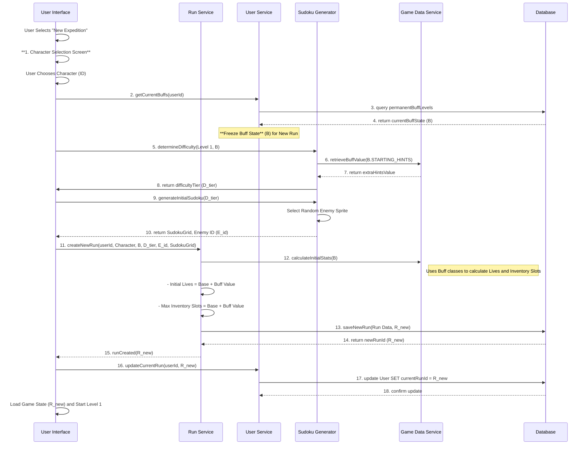

### Sequence Diagram: New Expedition (Start and Setup)

Models the new run creation flow, with character selection, permanent buff freezing, and level 1 initial data generation.

```mermaid
sequenceDiagram
    participant UI as User Interface
    participant RunService as Run Service
    participant UserService as User Service
    participant SudokuGenerator as Sudoku Generator
    participant GameDataService as Game Data Service
    participant DB as Database

    UI->>UI: User Selects "New Expedition"
    
    UI->>UI: **1. Character Selection Screen**
    UI->>UI: User Chooses Character (ID)
    
    UI->>UserService: 2. getCurrentBuffs(userId)
    UserService->>DB: 3. query permanentBuffLevels
    DB-->>UserService: 4. return currentBuffState (B)

    Note over UserService: **Freeze Buff State** (B) for New Run
    
    UI->>SudokuGenerator: 5. determineDifficulty(Level 1, B)
    SudokuGenerator->>GameDataService: 6. retrieveBuffValue(B.STARTING_HINTS)
    GameDataService-->>SudokuGenerator: 7. return extraHintsValue
    SudokuGenerator->>UI: 8. return difficultyTier (D_tier)

    UI->>SudokuGenerator: 9. generateInitialSudoku(D_tier)
    SudokuGenerator->>SudokuGenerator: Select Random Enemy Sprite
    SudokuGenerator-->>UI: 10. return SudokuGrid, Enemy ID (E_id)

    UI->>RunService: 11. createNewRun(userId, Character, B, D_tier, E_id, SudokuGrid)
    
    RunService->>GameDataService: 12. calculateInitialStats(B)
    Note right of GameDataService: Uses Buff classes to calculate Lives and Inventory Slots
    RunService->>RunService: - Initial Lives = Base + Buff Value
    RunService->>RunService: - Max Inventory Slots = Base + Buff Value

    RunService->>DB: 13. saveNewRun(Run Data, R_new)
    DB-->>RunService: 14. return newRunId (R_new)
    
    RunService-->>UI: 15. runCreated(R_new)
    
    UI->>UserService: 16. updateCurrentRun(userId, R_new)
    UserService->>DB: 17. update User SET currentRunId = R_new
    DB-->>UserService: 18. confirm update
    
    UI->>UI: Load Game State (R_new) and Start Level 1
```
