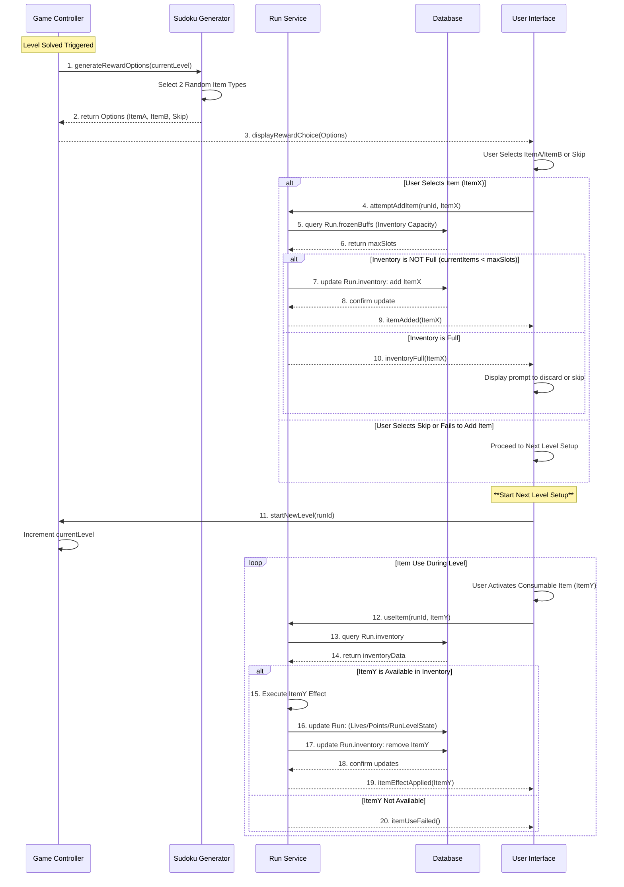

### Sequence Diagram: Level Reward and Item Usage

Models level completion reward choice (inventory capacity management) and single-use item usage in game.

```mermaid
sequenceDiagram
    participant GameController as Game Controller
    participant SudokuGenerator as Sudoku Generator
    participant RunService as Run Service
    participant DB as Database
    participant UI as User Interface

    Note over GameController: Level Solved Triggered
    
    GameController->>SudokuGenerator: 1. generateRewardOptions(currentLevel)
    SudokuGenerator->>SudokuGenerator: Select 2 Random Item Types
    SudokuGenerator-->>GameController: 2. return Options (ItemA, ItemB, Skip)

    GameController-->>UI: 3. displayRewardChoice(Options)
    
    UI->>UI: User Selects ItemA/ItemB or Skip
    
    alt User Selects Item (ItemX)
        UI->>RunService: 4. attemptAddItem(runId, ItemX)
        RunService->>DB: 5. query Run.frozenBuffs (Inventory Capacity)
        DB-->>RunService: 6. return maxSlots
        
        alt Inventory is NOT Full (currentItems < maxSlots)
            RunService->>DB: 7. update Run.inventory: add ItemX
            DB-->>RunService: 8. confirm update
            RunService-->>UI: 9. itemAdded(ItemX)
        else Inventory is Full
            RunService-->>UI: 10. inventoryFull(ItemX)
            UI->>UI: Display prompt to discard or skip
        end
    
    else User Selects Skip or Fails to Add Item
        UI->>UI: Proceed to Next Level Setup
    end

    Note over UI: **Start Next Level Setup**
    UI->>GameController: 11. startNewLevel(runId)
    GameController->>GameController: Increment currentLevel
    
    loop Item Use During Level
    UI->>UI: User Activates Consumable Item (ItemY)
        UI->>RunService: 12. useItem(runId, ItemY)
        
        RunService->>DB: 13. query Run.inventory
        DB-->>RunService: 14. return inventoryData
        
        alt ItemY is Available in Inventory
            RunService->>RunService: 15. Execute ItemY Effect
            
            RunService->>DB: 16. update Run: (Lives/Points/RunLevelState)
            RunService->>DB: 17. update Run.inventory: remove ItemY
            DB-->>RunService: 18. confirm updates
            RunService-->>UI: 19. itemEffectApplied(ItemY)
        else ItemY Not Available
            RunService-->>UI: 20. itemUseFailed()
        end
    end
```
