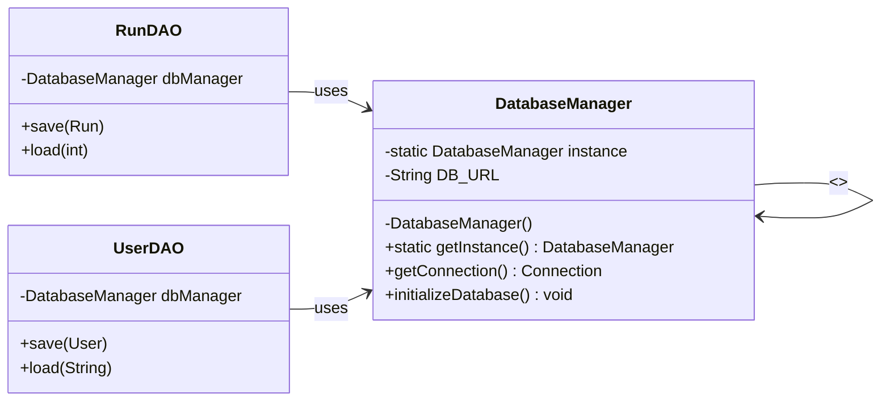

### Singleton Pattern (DatabaseManager)

The DatabaseManager class ensures a single point of access to the database connection, managing the SQLite driver and connection pool.

```mermaid
classDiagram
    direction LR
    
    class DatabaseManager {
        -static DatabaseManager instance
        -String DB_URL
        -DatabaseManager()
        +static getInstance() DatabaseManager
        +getConnection() Connection
        +initializeDatabase() void
    }

    class RunDAO {
        -DatabaseManager dbManager
        +save(Run)
        +load(int)
    }

    class UserDAO {
        -DatabaseManager dbManager
        +save(User)
        +load(String)
    }

    RunDAO --> DatabaseManager : uses
    UserDAO --> DatabaseManager : uses
    DatabaseManager --> DatabaseManager : <<Singleton>>
```
